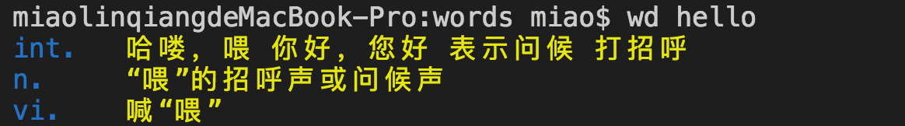

# translate-wd

记录单词、句子

## 使用 npm 安装

npm install -g translate-wd

## 用法

```
$ wd --help
$ wd hello 翻译
$ wd hello world 不翻译，仅记录
```

todo: 提醒
https://github.com/node-schedule/node-schedule
https://github.com/mikaelbr/node-notifier

<!--


在用户目录下/translate-wd/words.json 中会看见翻译的历史记录 -->
